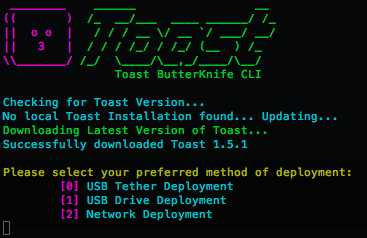
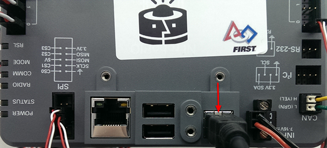

# ButterKnife
The new generation Toast deployment utility

## What's This
ButterKnife is a utility designed for the easy deployment of the latest version of the Toast API to your RoboRIO. Let's take a look at what to do  

## Firing up ButterKnife
ButterKnife is extremely easy to fire up. Head to the [releases](https://github.com/Open-RIO/ButterKnife/releases) page and download the latest version.  
### Windows  
Double click the ```butterknife.exe``` file to start ButterKnife.

### Mac / Linux
Open a command prompt and run ```ruby butterknife``` to start ButterKnife.

## Step 1: Choose your method
  There are 3 methods of deployment for you to choose from, so let's list them, easiest to hardest.  
    
  

### USB Tether
 USB Tethering is the quickest and easiest of the deployment options. All you need is ButterKnife and the USB cable that came with your RoboRIO

 

  Once your Robot is connected to your PC via the USB cable, selecting Option 0 *(USB Tether)* is enough to deploy Toast to your RoboRIO.

### USB Drive
  USB Drive Deployment uses a standard USB Flash Drive to deploy Toast onto your RoboRIO. While this requires more work than Tethering, it's useful for when you don't have a cable handy. Start the installer with your USB unplugged, and when it prompts you to, plug it back in. Butterknife will now copy the Toast files to your USB. Unplug your USB and plug it into your RoboRIO. Ensure you and the RoboRIO are on the same network and hit enter, this will allow Toast to complete the deployment process.

### Network
  Network Deployment is done completely wirelessly *(or wired if that's what you're into)*, without need for the USB Cable or a USB Flash Drive. When ButterKnife asks for your Preferred Method of deployment, be sure to connect to the same network as your RoboRIO *(remember to start the Installer with an internet connection -- you need it to download Toast!)*. The Installer will ask for your Team Number, and will then proceed to copy the Toast Files to your RoboRIO.  

  If the installer can't find your RoboRIO, restart the installer and make sure you're connected. On the off chance the installer doesn't find your RoboRIO's hostname OR IP Address, it will ask you to supply one manually. Do this if you've changed your RoboRIO's IP address. If all else fails, try and dig out that USB tethering cable or beg a mentor for a Flash Drive.

## Step 2: There is no Step 2!  
Your robot is now loaded with Toast! Restart your RoboRIO for the changes to take effect and you're well on your way to diving into the modular world of Toast.


## Thank you:
[net-scp](https://github.com/net-ssh/net-scp) and [net-ssh](https://github.com/net-ssh/net-ssh) for making Network Deployment possible in Pure Ruby.
